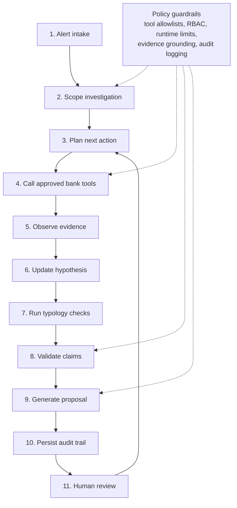

# Aria Agent Loop

Aria's agent loop is a bounded investigation workflow. The runtime controls
scope, tools, budgets, and persistence; the agent reasons within those limits.

## Loop Steps

1. **Alert intake**  
   Aria receives an AML alert, case, or customer risk-scoring request.

2. **Scope investigation**  
   The runtime binds the run to an alert ID, customer ID, case ID, tenant,
   officer, policy version, time window, and permitted tools.

3. **Plan next action**  
   The planner chooses the next evidence need, such as customer profile,
   transaction history, prior alerts, sanctions/PEP results, rule metadata, or
   counterparty context.

4. **Call approved bank tools**  
   Aria calls only allowlisted read-only adapters or bank-controlled MCP/API
   tools. Tool arguments are validated before execution.

5. **Observe evidence**  
   The agent receives structured records, limitations, and source references.
   Tool output is treated as untrusted input for prompt-injection purposes.

6. **Update hypothesis**  
   The agent revises its working explanation: likely false positive, needs
   investigation, escalation, structuring risk, velocity anomaly, sanctions/PEP
   risk, geography risk, or counterparty-network concern.

7. **Run typology checks**  
   Deterministic typology modules analyze patterns such as structuring, rapid
   movement of funds, high-risk geography, unusual velocity, sanctions/PEP
   exposure, and counterparty graph risk.

8. **Validate claims**  
   The validation layer checks each factual claim against retrieved evidence.
   Unsupported or contradictory claims are blocked or marked for review.

9. **Generate proposal**  
   Aria produces a human-review output: recommendation, risk score,
   investigation summary, or SAR draft.

10. **Persist audit trail**  
    The sidecar database stores evidence, tool calls, reasoning trace,
    validation report, confidence signals, recommendation, and human decision
    records.

11. **Human review**  
    A compliance officer approves, rejects, escalates, or requests more
    investigation. The final decision remains human-owned.

## Runtime Guardrails

- Tool allowlists by workflow and agent type.
- Scope checks for alert, customer, case, time window, rows, and graph hops.
- Runtime limits for max steps, tool calls, rows, timeout, and cost.
- Validation before user-facing conclusions.
- Append-only sidecar records for auditability.
- Fail-safe behavior toward human review when evidence is incomplete.
