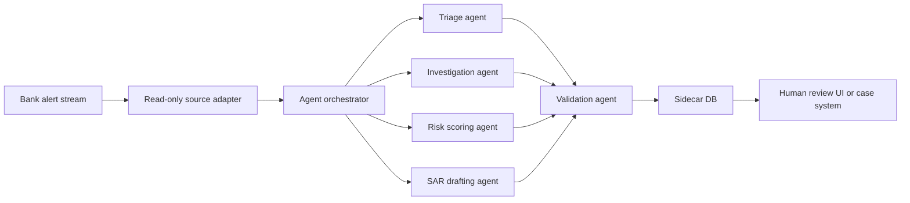

# Aria Architecture

## Throughline

Aria is a sidecar. It reads bank source data, performs AML investigation work,
validates generated claims against source evidence, and writes only to its own
sidecar database.

See also:

- [How Aria Works](how-it-works.md)
- [Agent Loop](agent-loop.md)
- [Banking Integration](banking-integration.md)

## Boundaries

### Source Adapter

The source adapter is the only code that reads bank data. It exposes business
methods such as `get_alert_context`, not arbitrary SQL. The PostgreSQL adapter
uses read-only sessions and allowlisted parameterized queries.

### Agent Layer

Agents never write to the bank source database. They receive source context and
produce:

- Recommendations.
- Scores.
- Draft narratives.
- Reasoning.
- Claims.
- Source references.

### Validation Layer

The validation agent checks that every factual claim has source evidence. If
validation fails, the output is persisted with `validation_failed` status and
must not be treated as an approved recommendation.

### Sidecar Store

The sidecar store records generated artifacts:

- `agent_runs`
- `evidence_items`
- `validation_reports`
- `recommendations`
- `risk_scores`
- `sar_drafts`
- `human_decisions`

No sidecar table is required in the bank source database.

## Agent Responsibilities

### Triage Agent

Fetches alert context, compares transaction behavior against the customer
baseline, activates relevant typology checks, and recommends one of:

- `likely_false_positive`
- `investigate`
- `escalate`

### Investigation Agent

Runs typology-specific checks for alerts that cannot be cleared by triage and
recommends whether to open a case, continue investigation, or return to triage.

### Risk Scoring Agent

Computes a proposed customer risk score from source facts such as current risk
level, KYC status, open alerts, critical alerts, behavioral patterns, sanctions,
and PEP screening.

### SAR Drafting Agent

Drafts a narrative from case facts. It never submits a report and always marks
the output as requiring human review.

### Compliance Validation Agent

Blocks unsupported factual claims by checking claim source references against
retrieved evidence.

## Extension Points

- Replace `PostgresBankSourceRepository` with an Oracle, DB2, SQL Server, file,
  API, or event-stream adapter.
- Replace `SidecarStore` with sidecar PostgreSQL for production scale.
- Add typology modules under `agents/typologies.py`.
- Add LLM summarization after deterministic facts are assembled and before
  validation.
- Split agents into workers when throughput requires it.
