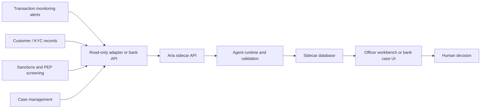

# Banking Integration

Aria is designed to connect beside existing banking software, not inside the
bank's source systems.

## Integration Boundary

The bank remains the owner of source data, authentication, authorization, and
final decisions. Aria should receive only the access needed for the active
investigation.

Recommended boundary:

- Source systems expose read-only views, APIs, exports, or MCP tools.
- Aria maps those sources into `BankSourceRepository` methods.
- Generated artifacts are written to sidecar storage.
- Human decisions can be exported back to the bank's system of record through a
  separate governed path.

## Required Source Context

For alert triage, Aria needs:

- alert details,
- matched rule metadata,
- triggering transaction,
- account and customer profile,
- recent customer transactions,
- behavioral baseline,
- prior alerts and cases,
- sanctions and PEP screening results.

For risk scoring, Aria needs:

- customer profile,
- accounts,
- latest behavior pattern,
- recent transactions,
- open and prior alerts,
- sanctions and PEP matches.

For SAR drafting, Aria needs:

- case record,
- customer context,
- linked alerts,
- relevant transactions,
- officer comments.

See [Data Contract](data-contract.md) for the reference shape.

## Sidecar Storage

Aria stores generated and derived records separately from source systems:

- agent runs,
- evidence items,
- validation reports,
- recommendations,
- risk scores,
- SAR drafts,
- human decisions.

For local evaluation, SQLite is enough. For a bank pilot, use managed sidecar
storage with encryption, backups, retention policies, audit access, and
environment-specific credentials.

## Pilot Checklist

- Provision read-only source access or bank-controlled tool APIs.
- Confirm Aria cannot write to source tables.
- Configure sidecar storage outside source-system schemas.
- Run deterministic workflows before enabling any LLM planner path.
- Review sidecar audit records with AML, security, model risk, and engineering
  owners.
- Replay historical alerts before making any operational benefit claim.

## Non-Negotiables

- No arbitrary SQL generated by an LLM against bank systems.
- No autonomous alert dismissal.
- No autonomous SAR filing.
- No source-system mutation from the agent layer.
- No production false-positive claim without bank-specific evaluation.
