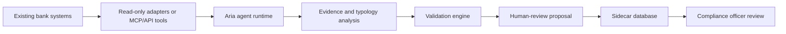

# How Aria Works

Aria is an AML risk intelligence sidecar. It connects to existing banking
systems through read-only adapters or bank-controlled tools, runs bounded
agent workflows, validates factual claims, and stores generated outputs in a
separate sidecar database.

Aria does not replace transaction monitoring, case management, sanctions
screening, or human AML decisioning. It adds an investigation and explanation
layer around those systems.

## Core Flow

1. A bank alert or case enters Aria through the API or demo workbench.
2. Aria scopes the run to the active alert, customer, case, time window, and
   allowed tools.
3. The agent gathers structured evidence from approved sources.
4. Deterministic typology checks and optional LLM planning help form an
   investigation summary.
5. The validation layer checks factual claims against retrieved evidence.
6. Aria creates a human-review proposal: triage recommendation, investigation
   summary, risk score, or SAR draft.
7. Evidence, traces, validation reports, proposals, and human decisions are
   persisted in sidecar storage.

## What Aria Produces

- Triage recommendation: `likely_false_positive`, `investigate`, or `escalate`.
- Investigation output with typology signals and evidence references.
- Customer risk score proposal with contributing factors.
- SAR draft narrative for authorized human review.
- Validation report for unsupported, missing, stale, or contradictory evidence.
- Audit trail of agent run metadata and generated artifacts.

## What Aria Does Not Do

- It does not autonomously dismiss alerts.
- It does not file SARs.
- It does not mutate bank source systems.
- It does not grant officer permissions.
- It does not claim production false-positive reduction without a bank-specific
  replay evaluation.

## Active Implementation

The core Python implementation is under `src/compliance_agent`. The import
package is `compliance_agent`; the public project name is Aria.

The demo stack adds:

- `backend/` for the optional workbench API.
- `frontend/` for the optional analyst workbench UI.
- `mcp_server/` for reference tool-server behavior.
- `docker-compose.yml` for a local seeded demo.
